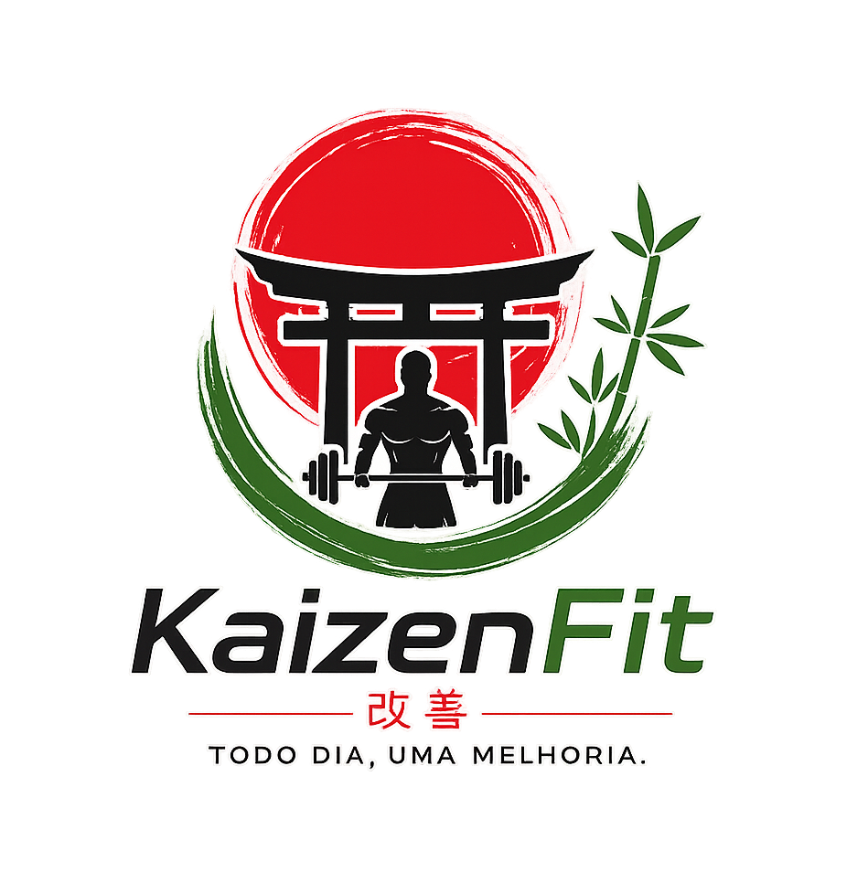

# KaizenFit
## SESI SENAI | Desenvolvimento de Sistemas

teste de pull request

  

  <strong>Todo dia, uma melhoria.</strong>

---

# Sobre o Projeto

Neste trabalho, faremos um site na qual dê suporte a necessitados (obesos, idosos, magros, falta de autoestima e etc), ajudando-os a cuidarem da própria saúde por meio de exercícios físicos, dietas, disciplina e responsabilidade com seu próprio corpo e saúde. Fazendo-os sentirem bem consigo mesmo. Incentivando-os e ajudando-os a evoluir a cada dia de forma contínua e disciplinar, enfatizando o nome Kaizen.

A proposta é incentivar a evolução diária por meio de:
- Exercícios físicos  
- Alimentação saudável  
- Disciplina e constância  

Tudo isso inspirado na filosofia **Kaizen**, que significa melhoria contínua.

---

# Objetivo

Nosso objetivo é oferecer uma plataforma que motive os usuários a:

- Praticar exercícios
- Melhorar a alimentação
- Criar rotina saudável
- Acompanhar sua evolução
- Interagir com outras pessoas

---

# Funcionalidades

- Cadastro e login de usuários
- Planos de treino
- Sugestões de dieta
- Registro de evolução física
- Área de comunidade/chat
- Notificações e lembretes

---

# Comunidade

O sistema possui uma área de comunidade com:

- Chat Geral
- Chat 1
- Chat 2
- Chat 3
- Chat 4

Os usuários podem conversar, trocar experiências, dicas e motivar uns aos outros.

---

# Tecnologias Utilizadas

- HTML
- CSS
- JavaScript
- MySQL
- GitHub
- Scrum

---

# Equipe

## Tomás — Scrum Master

- GitHub
- Banco de Dados
- Organização geral

## Alex — Programador

- HTML
- CSS

## Kaio Richard — Programador

- JavaScript
- Banco de Dados
- Suporte ao GitHub

---

# Requisitos Funcionais

- Cadastro de usuários
- Login
- Exercícios físicos
- Sugestões de dieta
- Comunidade/chat
- Participação em diferentes chats
- Atualização de perfil
- Funcionamento em computador e celular

---

# Requisitos Não Funcionais

- Interface simples e intuitiva
- Site responsivo
- Segurança dos dados
- Boa organização visual
- Compatibilidade com navegadores modernos

---

## Links do Projeto
- [Documentação](https://docs.google.com/document/d/1D_cWXXJgefwoUnmwYxhosaDcSyaRMcZurMPY9kINUdw/edit?usp=sharing)
- [Protótipo no Canva](https://canva.link/bf4r9it20w49kgb)

---

# Filosofia do Projeto

O KaizenFit acredita que pequenas melhorias feitas todos os dias podem gerar grandes resultados no futuro.
